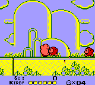
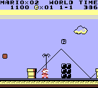

  
   
  Retro Boy is a simple Game Boy emulator written in Rust that can be played on the web. <a href="https://smparsons.github.io/retroboy">Try it here.</a>

## How to Compile to WebAssembly

To compile the implementation to WebAssembly, you will first need to install wasm-pack with the command `cargo install wasm-pack` if you haven't done so already. Then, run `sh ./build-wasm.sh` to build the core project and generate the Javascript binding code in the web frontend directory.

## Web Frontend

The web frontend for this emulator is a React/TypeScript app designed with Material UI. It is located in the frontends/web folder. The UI provides the ability to load a ROM as well as play, pause, or reset the emulator. It also provides a fullscreen mode.

To run the web frontend:

1. Compile the Rust code to WebAssembly and generate the Javascript binding code as described in the "How to Compile to WebAssembly" section.
2. When the binding code is generated, it will be added to the frontends/web/src/core directory.
3. Run `yarn install` in the frontends/web directory to install all dependencies.
4. Run `yarn start` in the same directory to run the application locally.

## Screenshots

  
  
    
  

## Test ROMs

This emulator passes the following test suites from Blargg's test ROM collection:

1. [CPU instruction tests](https://github.com/retrio/gb-test-roms/tree/master/cpu_instrs)
2. [CPU instruction timing tests](https://github.com/retrio/gb-test-roms/tree/master/instr_timing)
3. [Memory timing tests](https://github.com/retrio/gb-test-roms/tree/master/mem_timing)
4. [Memory timing tests 2](https://github.com/retrio/gb-test-roms/tree/master/mem_timing-2)
5. [Interrupt timing tests (CGB)](https://github.com/retrio/gb-test-roms/tree/master/interrupt_time)
6. [APU tests (DMG)](https://github.com/retrio/gb-test-roms/tree/master/dmg_sound)
7. [APU tests (CGB)](https://github.com/retrio/gb-test-roms/tree/master/cgb_sound)

Additionally, this emulator passes all [JSON CPU tests](https://github.com/adtennant/GameboyCPUTests), and
only some tests from the [Mooneye test ROM collection](https://github.com/Gekkio/mooneye-test-suite).

## Test Suite

This project holds a fairly extensive test suite, as the bulk of the logic was designed using a TDD approach. There are a lot of tests that exercise CPU opcodes, and basic tests that exercise the GPU. Run `cargo test` to run the test suite.

## Supported Features

This emulator is still a work in progress and not all features are supported.

| Feature           | Supported |
| ----------------- | --------- |
| CPU               | ✅        |
| Basic Graphics    | ✅        |
| Audio             | ✅        |
| Color Support     | ✅        |
| GameShark Support | ❌        |

### MBC Support

| Type | Supported |
| ---- | --------- |
| MBC1 | ✅        |
| MBC2 | ❌        |
| MBC3 | ✅        |
| MBC5 | ✅        |
| MBC6 | ❌        |
| MBC7 | ❌        |

## Helpful Resources

I described some of the resources I used to build this emulator in a [blog post](https://samthecoder.com/must-have-resources-for-building-a-gameboy-emulator).

For convenience, here is a list of the resources I used:

1. [Gameboy CPU Manual](http://marc.rawer.de/Gameboy/Docs/GBCPUman.pdf)
2. [Pan Docs](https://gbdev.io/pandocs/)
3. [Blargg's Test ROM Collection](https://github.com/retrio/gb-test-roms)
4. [Gameboy Doctor](https://github.com/robert/gameboy-doctor)
5. [Imran Nazar's Gameboy Emulator Tutorial](https://imrannazar.com/series/gameboy-emulation-in-javascript)

## Future Plans

The following games work pretty well with this emulator:

1. Tic-Tac-Toe
2. Tetris
3. Kirby's Dream Land
4. Pac-Man
5. Super Mario Land
6. Pokemon Red
7. Pokemon Silver

I am going to continue testing this emulator with more games in the future.
